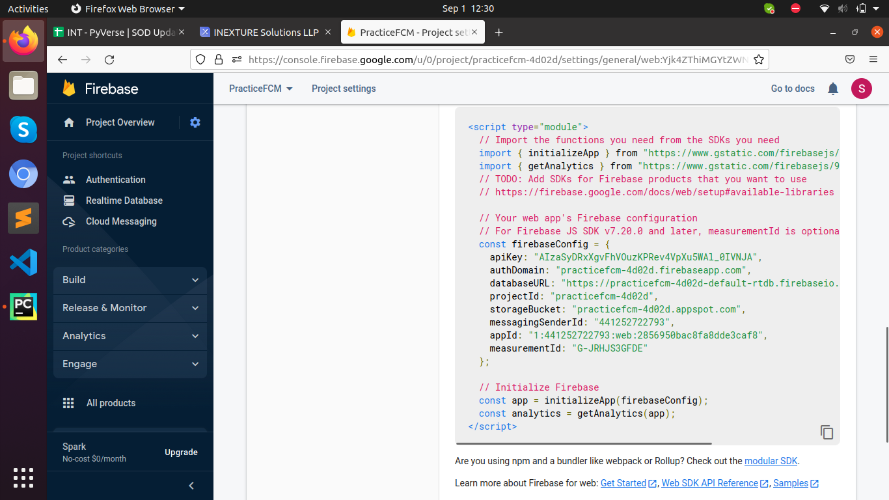
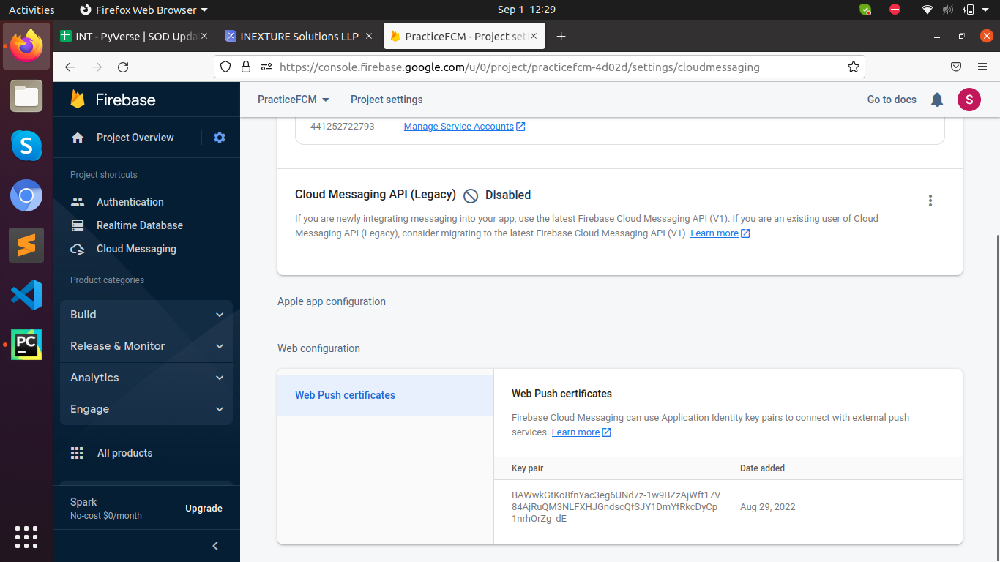

# Django FCM

***
Django FCM is used to push notification to web app, Android App and iOS apps using Realtime Database and Cloud Messaging.
***

## Setup

git clone command **:** 
```
git clone https://github.com/SanskarMehta/django_fcm.git
```

### 1. Setup The Project

For the installation Process here I have attached the documentation Link **:**

```
pip install -r requirements.txt
```

Please refer these links for more information of fcm-django **:**
```
https://fcm-django.readthedocs.io/en/latest/	
```    

# Packages Used

## fcm-django
`fcm-django` is a package which is compatible with Django and mainly used to allow the Push notification services to the web apps.
- <a href="https://pypi.org/project/fcm-django/" target="_blank">Package Link</a>

## firebase_admin
The Firebase Admin Python SDK enables server-side (backend) Python developers to integrate Firebase into their services and applications.
- <a href="https://pypi.org/project/firebase-admin/" target="_blank">Package Link</a>

***
# Configuration of Firebase
- We have to set up the firebase app in `setting.py` in `Django` or `DRF` for enabling the cloud messaging in project.
### 1. Initialization of Firebase App **:**
- We have to set an environment variable `GOOGLE_APPLICATION_CREDENTIALS` which is a path pointing to your JSON-file stored credentials. Following command automatically detects the credentials and passes to the `initialize_app()`.
```
firebase_admin.initialize_app()
```
OR
- We also have another way to initialize the firebase app by passing the credentials in `initialize_app()`.Which is similar to below command.
```
cred = credentials.Certificate(os.path.join(PROJECT_APP, '../credentials-of-fcm.json'))
firebase_admin.initialize_app(cred)
```

### 2. Migration of Database : 
- After Initialization process we need to migrate the project because initially firebase creates one model in our project's database.
- `FCMDevice` name model is created in project after running the migration command. Which basically consist the registration tokens or we can say the devices which allows the notification.
```
python manage.py migrate
```

### 3. Creating Service Worker and Initializing it with firebase app: 
- To get the registration token we need to add some JavaScript code in our HTML. Which is used to get the token of devices which allow the notifications and also revert this token back to server to store the data in database.
- for that we have to create service worker in JavaScript, which provides the token to server. Code of service worker is as per below which is added in `index.html`.
```
<script src="https://www.gstatic.com/firebasejs/8.6.3/firebase-app.js"></script>
<script src="https://www.gstatic.com/firebasejs/8.6.3/firebase-analytics.js"></script>
<script src="https://www.gstatic.com/firebasejs/8.6.3/firebase-messaging.js"></script>
<script>        
        var firebaseConfig = {
                  apiKey: "<YOUR_API_KEY>",
                  authDomain: "<YOUR_AUTH_DOMAIN>",
                  databaseURL: "<YOUR_DATABASE_URL>",
                  projectId: "<YOUR_PROJECT_ID>",
                  storageBucket: "<YOUR_STORAGE_BUCKET>",
                  messagingSenderId: "<YOUR_MESSAGING_SENDER_ID>",
                  appId: "<YOUR_APP_ID>",
                  measurementId: "<YOUR_MEASUREMENT_ID>"
        };
        // Initialize Firebase
        firebase.initializeApp(firebaseConfig);
        firebase.analytics();

        const messaging = firebase.messaging();
        console.log(messaging.getToken())
        messaging.getToken({ vapidKey: '<YOUR_VAPID_KEY>' }).then((currentToken) => {
        if (currentToken) {
          sendTokenToServer(currentToken)
        } else {
          console.log('No registration token available. Request permission to generate one.');
        }
      }).catch((err) => {
        console.log('An error occurred while retrieving token. ', err);
      });


        messaging
         .requestPermission()
         .then(function () {
           console.log("Notification permission granted.");
           return messaging.getToken()
         })
         .catch(function (err) {
         console.log("Unable to get permission to notify.", err);
       });

        messaging.onMessage((payload) => {
        console.log('Message received. ', payload);
      });
      }
</script>
```
- In the above code we have to pass the different `firebaseConfig` parameters which are created when we create a new firebase app and the url for that is as per given below:
<a href="https://firebase.google.com/docs/cloud-messaging">URL For Firebase App Documentation</a>
- To pass the token to server we have to create a AJAX call or write some JavaScript function in above script which is used to send the token to particular endpoint. Code for sending token to sever is as per given below **:**
```
      // Send the Instance ID token your application server, so that it can:
      // - send messages back to this app
      function sendTokenToServer(currentToken) {
        {
          console.log('Sending token to server...');
          console.log(currentToken);
          // TODO(developer): Send the current token to your server.
          fetch('http://127.0.0.1:8000/home/', {
            method: "post",
            headers: {
                'Content-Type': 'application/json'
              },
            body: JSON.stringify({
              'registration_id': currentToken,
              'type': 'web',
            }),
            credentials: "include",
          }).then(function(response) {
            console.log(response);
          })
        }
```

- So final script is similar to this and we have to include this in the `<head>` of the `index.html` **:** 
```
    <script src="https://www.gstatic.com/firebasejs/8.6.3/firebase-app.js"></script>
    <script src="https://www.gstatic.com/firebasejs/8.6.3/firebase-analytics.js"></script>
    <script src="https://www.gstatic.com/firebasejs/8.6.3/firebase-messaging.js"></script>

     <script>
        var firebaseConfig = {
                  apiKey: "<YOUR_API_KEY>",
                  authDomain: "<YOUR_AUTH_DOMAIN>",
                  databaseURL: "<YOUR_DATABASE_URL>",
                  projectId: "<YOUR_PROJECT_ID>",
                  storageBucket: "<YOUR_STORAGE_BUCKET>",
                  messagingSenderId: "<YOUR_MESSAGING_SENDER_ID>",
                  appId: "<YOUR_APP_ID>",
                  measurementId: "<YOUR_MEASUREMENT_ID>"
        };
        // Initialize Firebase
        firebase.initializeApp(firebaseConfig);
        firebase.analytics();

        const messaging = firebase.messaging();
        console.log(messaging.getToken())
        messaging.getToken({ vapidKey: '<YOUR_VAPID_KEY>' }).then((currentToken) => {
        if (currentToken) {
          sendTokenToServer(currentToken)
        } else {
          console.log('No registration token available. Request permission to generate one.');
        }
      }).catch((err) => {
        console.log('An error occurred while retrieving token. ', err);
      });


        messaging
         .requestPermission()
         .then(function () {
           console.log("Notification permission granted.");
           return messaging.getToken()
         })
         .catch(function (err) {
         console.log("Unable to get permission to notify.", err);
       });

        messaging.onMessage((payload) => {
        console.log('Message received. ', payload);
      });


      // Send the Instance ID token your application server, so that it can:
      // - send messages back to this app
      function sendTokenToServer(currentToken) {
        {
          console.log('Sending token to server...');
          console.log(currentToken);
          // TODO(developer): Send the current token to your server.
          fetch('http://127.0.0.1:8000/home/', {
            method: "post",
            headers: {
                'Content-Type': 'application/json'
              },
            body: JSON.stringify({
              'registration_id': currentToken,
              'type': 'web',
            }),
            credentials: "include",
          }).then(function(response) {
            console.log(response);
          })
        }
      }
     </script>
```

- I have added some screenshots from where we will get `firebaseConfig` and `vapid_key` of the Firebase Project.
- Here we will get `firebaseConfig` values in `Project Settings` on `Firebase Website` and in `General` Tab of our Project and in that `CDN or SDK setup and Configuration` consist the values as shown the image.


- VapidKey will be shown in `Cloud Messaging` section in which `web configuration` consist the Generate Key option which generates the `Public Key` for particular Project which is known as `VapidKey` , which is as shown in image.



### 4. Sending a Message:
- FCM provides the `send_message()` function to send the `Messages` and `Notifications`.
- I have created `messaging.py` file in which `send_notification` is a generic function which is used to send the notifications to the registered devices.
- For exp use of `send_message()` is as below :
```
FCMDevice.objects.send_message(Message(notification=Notification(title=title, body=message)))
```